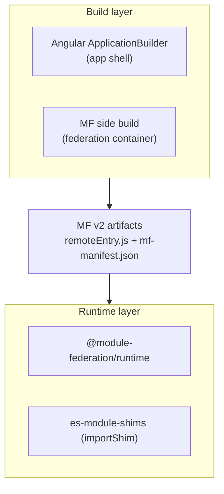

# Architecture

The adapter is two cooperating layers: a **build** side that *produces* Module
Federation v2 artifacts, and a **runtime** side that *consumes* them. Both reuse
the same module-sharing foundation as Native Federation — es-module-shims import
maps — so the change from NF is the orchestration and the artifact contract, not
the loader.

## The two-build model

Angular's own `ApplicationBuilder` builds the application shell. The federation
container is built **separately** by `@module-federation/esbuild`'s
`moduleFederationPlugin`. They are kept separate because the MF plugin cannot
compile Angular (templates, decorators, DI) — Angular's compiler must own that.
Shared dependencies are marked `external` in the app build so they resolve from the
shared scope instead of being bundled twice.

## One-pass composition

The federation container still needs the *exposed* components compiled by Angular.
Rather than compile-then-federate in two passes, the MF plugin is **injected into
the Angular esbuild context as an extra plugin**: the Angular compiler compiles the
exposed `.ts`, and in the same build the MF plugin wraps them into the container and
emits `mf-manifest.json`. The plugin's own nested sub-build (for shared packages)
runs commonjs-only, so the Angular compiler never runs twice.

## Runtime: orchestration vs. loading

Two concerns are separate at runtime:

- **Orchestration** — `@module-federation/runtime` (`createInstance` /
  `loadRemote`) decides *what* to load and negotiates the shared scope.
- **Loading** — the actual module resolution flows through **es-module-shims import
  maps**: the emitted container calls `importShim.addImportMap(...)`. This is the
  same mechanism Native Federation uses, which is why a single shared
  `@angular/core` behaves as it already does under NF.

Shared singletons (`singleton` / `strictVersion` / `requiredVersion`) are how a
single Angular instance is guaranteed across the host↔remote boundary.

## Relationship to Native Federation

Conceptually the same adapter shape (familiar `withModuleFederation` / `share` /
`shareAll` config, es-module-shims loader, the Angular builder glue). What changed:
the **orchestrator** (`@module-federation/runtime` instead of NF's), and the
**artifact contract** (`mf-manifest.json` + an ESM `remoteEntry.js` instead of NF's
`remoteEntry.json`).

**What you gain:** interoperability with the wider Module Federation v2 ecosystem —
an Angular app can consume, and be consumed by, stock webpack/rspack MF hosts.

**What you pay:** a dependency on `@module-federation/esbuild` (currently an early
`0.0.x` line — see [known issues](./known-issues.md)), the same Angular-private-API
maintenance as NF, and a continued reliance on es-module-shims.

## Relationship to Module Federation

Because the adapter emits the MF v2 contract and runs on `@module-federation/runtime`,
it interoperates **both directions** with any MF v2 participant. The host side
registers remotes by their `mf-manifest.json` URL; the remote side emits artifacts a
stock MF host can consume. The one interop nuance is `library.type`: the Angular
remote emits `"esm"`, whereas a stock webpack host defaults to `"global"`/`var`, so
cross-loading requires matching that (and CORS is always required for fetches).
