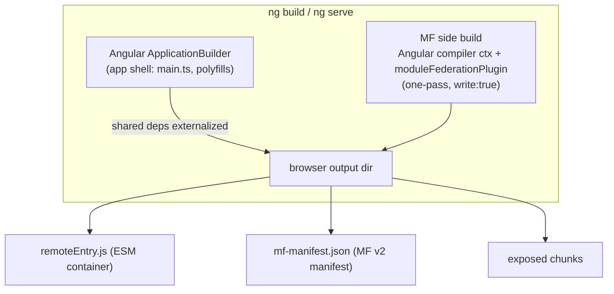
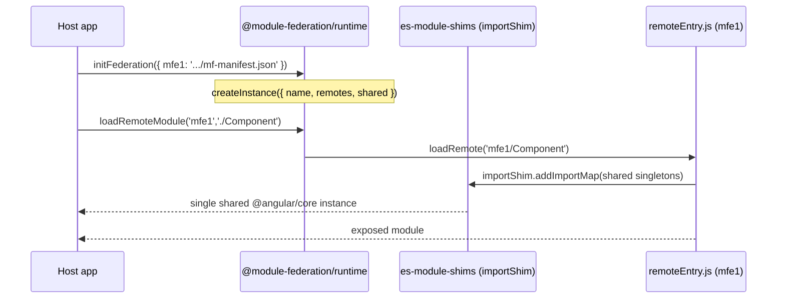
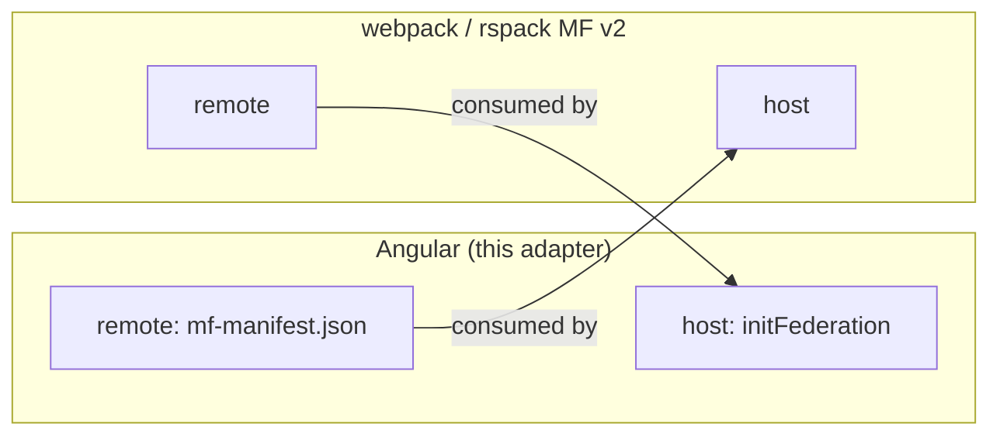

# `@angular-architects/module-federation-esbuild`

An Angular adapter for **Module Federation v2**, built on
`@module-federation/runtime` + `@module-federation/esbuild`. It lets an Angular app
**consume** and **produce** MF v2 remotes that interoperate with stock
webpack/rspack Module Federation hosts.

> **Status:** the adapter is code-complete and statically verified (typecheck +
> lint + unit tests). End-to-end behaviour (a running host loading a remote in a
> browser) is **not yet verified** — see [Constraints & known issues](./known-issues.md).
> Treat this as the *intended* usage.

---

## How to use it

### 1. Add the package

```bash
ng add @angular-architects/module-federation-esbuild
```

This wires the builder, scaffolds `federation.config.mjs`, makes `main.ts` async,
and adds `es-module-shims` to the polyfills.

### 2. Configure (`federation.config.mjs`)

```js
import { withModuleFederation, shareAll } from '@angular-architects/module-federation-esbuild/config';

export default withModuleFederation({
  name: 'mfe1',

  // Remotes only: expose modules consumable by hosts.
  exposes: { './Component': './src/app/app.component.ts' },

  shared: {
    ...shareAll({ singleton: true, strictVersion: true, requiredVersion: 'auto' }),
    '@angular/core': { singleton: true, strictVersion: true, requiredVersion: 'auto', includeSecondaries: true },
  },

  skip: ['rxjs/ajax', 'rxjs/fetch'],
});
```

### 3. Host — load a remote at runtime

```ts
import { initFederation } from '@angular-architects/module-federation-esbuild';

const { loadRemoteModule } = initFederation({
  mfe1: 'http://localhost:4201/mf-manifest.json',
});

const m = await loadRemoteModule('mfe1', './Component');
// or lazily, without prior registration:
await loadRemoteModule({ remoteEntry: 'http://localhost:4201/mf-manifest.json', exposedModule: './Component' });
```

`initFederation(remotes, options?)` is **synchronous** and returns
`{ loadRemoteModule, instance }`. The host's `@angular/*` + `rxjs`/`zone.js` are
registered as singletons by default (`DEFAULT_ANGULAR_SHARED`).

### 4. Remote — expose components

List them under `exposes` in `federation.config.mjs` (step 2). `ng build` emits
`remoteEntry.js` + `mf-manifest.json` into the browser output dir.

---

## How it works

Two builds run side by side: Angular's `ApplicationBuilder` for the **app shell**,
and a **separate esbuild side build** (`@module-federation/esbuild`'s
`moduleFederationPlugin`) for the **federation container** — injected into the same
Angular compiler context (one pass), so exposed components are compiled by Angular
*and* federated by MF together.



At runtime the container shares modules through **es-module-shims import maps**
(`importShim`) — the same loader Native Federation uses — while
`@module-federation/runtime` provides the `loadRemote` orchestration:



**Key components in this repo:** runtime `src/index.ts`; MF side build
`src/tools/mf/*`; config DSL `src/config/with-module-federation.ts`; both builders
`src/builders/{build,remote}/builder.ts`.

---

## How it differs from the Native Federation Angular adapter

Same overall shape and familiar config helpers — the engine and artifacts change.

| Aspect | Native Federation | This adapter (MF-esbuild) |
|---|---|---|
| Runtime | `@softarc/native-federation-orchestrator` | `@module-federation/runtime` (`createInstance`/`loadRemote`) |
| Build core | `@softarc/native-federation` | `@module-federation/esbuild` `moduleFederationPlugin` |
| Manifest | `remoteEntry.json` | `remoteEntry.js` + `mf-manifest.json` (MF v2) |
| Config | `withNativeFederation` / `share` / `shareAll` | `withModuleFederation` / `share` / `shareAll` (same shape) |
| `initFederation` | returns a `Promise` | **synchronous**; `shimMode`/`sse`/`cacheTag` dropped |
| Module loader | es-module-shims import maps | **es-module-shims import maps (unchanged)** |
| Interop | NF hosts only | **stock webpack / rspack MF v2 hosts** |

The headline: it keeps NF's es-module-shims foundation and familiar config, but
swaps the orchestrator + manifest for the Module Federation v2 contract — so
Angular apps join the broader MF ecosystem.

---

## How it works with Module Federation

Because it emits the MF v2 contract (`mf-manifest.json` + an ESM `remoteEntry.js`)
and runs on `@module-federation/runtime`, it interoperates **both directions** with
any MF v2 host/remote (webpack, rspack, or another MF-esbuild app):



Shared dependencies use MF's `shared` scope (`singleton` / `strictVersion` /
`requiredVersion`) so a single `@angular/core` is negotiated across the boundary.

> ⚠️ **Interop caveat:** the Angular remote emits `remoteEntry.type: "esm"`; a stock
> webpack host defaults to `"global"`/`var`, so cross-loading requires matching
> `library.type`, and CORS is still required for manifest/chunk fetches.
